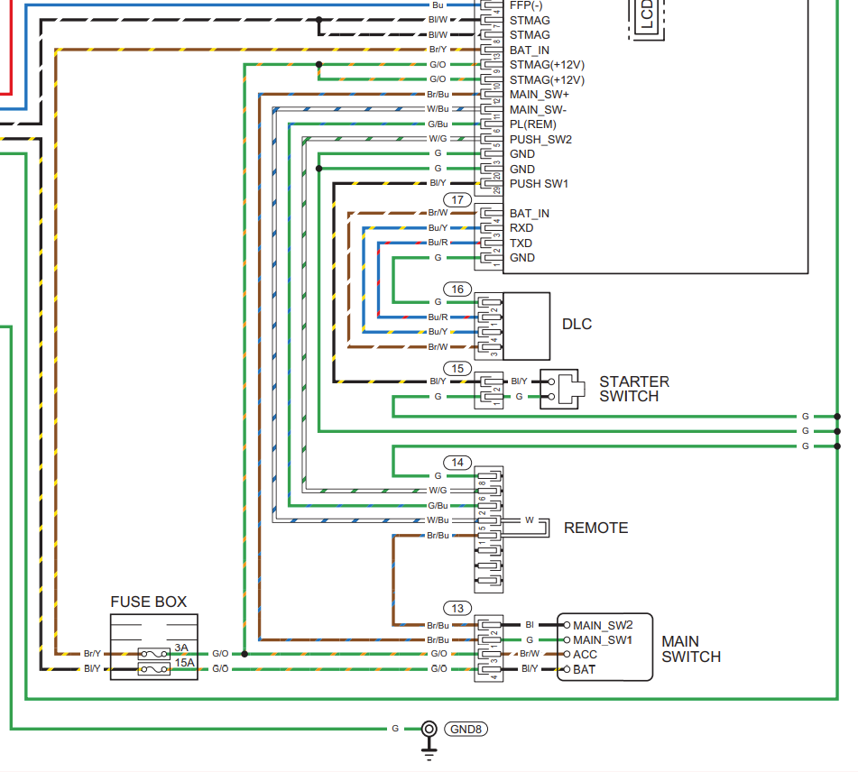

# Honda Gen Remote Hardware

Here you will find a kicad project and schematic for building an esp32
remote for your honda EU7000is.

The purpose of this device is to interface an esp32 with the DLC port and
the remote start port. This project uses optical isolators between the 
generator and the esp32 microcontroller.

## Schematic
The schematic for this project is available [here](schematic.pdf?raw=true).

It's useful to reference the Honda Gen schematic aswell to understand how to wire
the connectors:


## The Remote Start Connector
The remote start connector uses a [Sumitomo HM 6090-1021 Connector](https://prd.sws.co.jp/components/en/detail.php?number_s=60901021)

It has 8 pins. 5 of which are populated.

| Pin | Description        | Color |
| --- | ------------------ | ----- |
| 1   | Kill SW p2         | Brown/Blue |
| 2   | Running Indicator  | Green/Blue |
| 3   | N/A                |       |
| 4   | N/A                |       |
| 5   | Kill SW p1         | White/Blue |
| 6   | Start              | White/Green |
| 7   | N/A                |       |
| 8   | GND                | Green |

When looking at the female connector on the generator. The pins
are in the following order:
```
8 7 6 5
4 3 2 1
```

## The DLC Connector
The physical connector is described here: https://github.com/blaisejarrett/Honda-Gen-PGM-FI-Protocol#physical-layer

